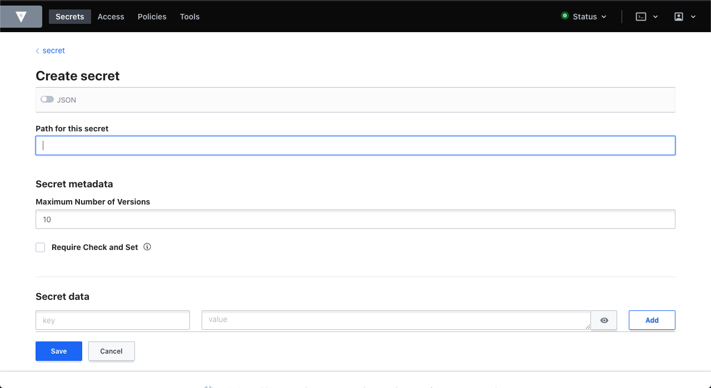

# Secret management with Hashicorp Vault

Using env files to manage application configuration has been a de-facto standard for a while now.<br/>

With deployment pipelenes growing more complex and web-service becoming cloud-native, logic to securely manage and rotate these secrets on different stages often occupies a large percentage of our source code.<br/>

Many tools and services are emerging to solve this problem, and one of the most popular among them is Hashicorp Vault.<br/>

It provides a dedicated server managing secrets, encryption of data, and easy access protocol, additionally it's 100% cloud-native.

## Setting up Vault using Docker

Using `docker-compose`

```bash
docker-compose up -d
```

Using `docker-cli`

```bash
docker run \
  -d \
  -e 'VAULT_DEV_ROOT_TOKEN_ID=secrettoken' \
  -e 'VAULT_DEV_LISTEN_ADDRESS=0.0.0.0:8300' \
  -p 8300:8300 \
  vault:1.6.2
```

## Configuring secrets

- Open `localhost:8300` inside browser
- Login using token
- Click on `/secret` engine and click on `new secret`
- Add secret path as `database` and follwing key-value pairs for it.

```
username: <---YOUR_DB_USERNAME--->
password: <---YOUR_DB_PASSWORD--->
```



Check Vault UI tutorials [here](https://learn.hashicorp.com/collections/vault/getting-started-ui).

## Commands

```bash
# run main file
go run main.go

# run test
go test ./...
```

## Usage of default KV engine in unit tests

Since the Vault API client is developed to read data from the vault and not the other way around, creating a new engine for test is not possible, therefore using default `secret` engine.

## Ideas for configuration pipeline

While writing a microservice, combine-usage of Vault and env files can provide a robust way to inject secrets inside our app.

- env files can contain non-sensitive values along with paths(for Vault) for secrets.
- Vault can be configured, and used to inject sensitive values like passwords, API keys and other credentials.

For more about above implementation check out this [video](https://youtu.be/7UmJR0dOkjM).

## Author
**Akshit Sadana <akshitsadana@gmail.com>**

- Github: [@Akshit8](https://github.com/Akshit8)
- LinkedIn: [@akshitsadana](https://www.linkedin.com/in/akshit-sadana-b051ab121/)